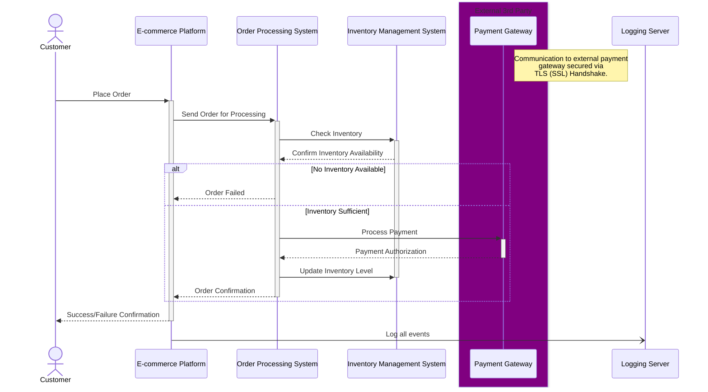

# Mermaid-UML-Test

# Sequence Diagram

# Explanation

## Sequence

1. Order Placement:

- The customer places an order on the e-commerce platform.
- The order details are sent to the order processing system.

2. Check Inventory:

- The order processing system checks the inventory levels in the new inventory management system.
- The system ensures that the items are in stock.

3. Inventory Available:

- Inventory management system reports whether enough inventory is available.
- If there is not enough inventory to satisfy the order, order is cancelled and user notified.

4. Process Payment:

- The order processing system communicates with the third-party payment gateway to process the payment securely.
- Secure channels and authentication mechanisms are used to ensure data integrity and confidentiality. (SSL, TLS over REST most likely to external gateway)

5. Payment Authorization:

- The payment gateway processes the payment and sends an authorization response back to the order processing system.

6. Inventory Available/Update:

- Inventory management system updates inventory, reducing levels by quantity in order. This is performed after payment confirmation to avoid reducing inventory for unsuccessful orders.

7. Order Confirmation:

- Upon successful payment, the order processing system sends an order confirmation back to the e-commerce platform.
- The customer is notified of the order confirmation.

## Considerations

Audit Log:

- All interactions are logged to a logging server for audit purposes (timestamps, system interactions, and any errors encountered).
- Logs include details from order placement, inventory checks and modification, payment processing, and order confirmation.

Security:

- Authentication: Each system interaction requires authentication to verify the identity of the communicating systems. Identification verification is achieved using SSH certificates.
- Encryption: All data encrypted in transit via SSL/TLS and at rest via AES.
